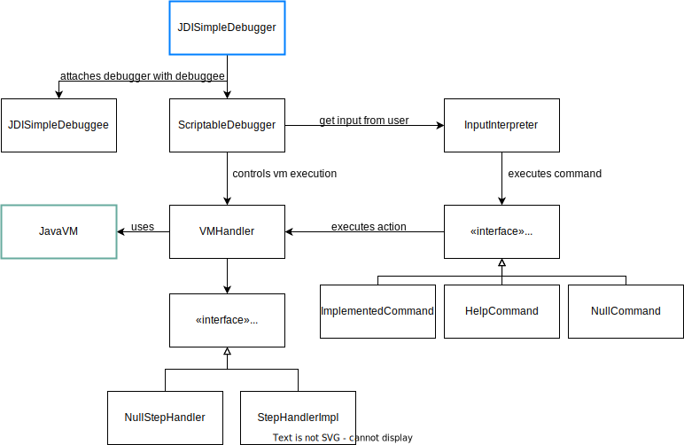

# Mini Java Debugger Implementation

This is a mini-implementation of a Java Debugger using the Java Debugger Interface (JDI). For running the program, you need to execute the main entry point class `JDISimpleDebugger`. You will have the terminal opened and you can enter te following commands:

- **step** executes the next instruction. If it is une method call, the execution will enter into the method.
- **step-over** executes the current line.
- **continue** continues the execution until the next breakpoint. The granularity is the step execution.
- **frame** returns and prints the current frame.
- **temporaries** returns and prints the list of temporary variables of the current frame, under the form of pairs nom -> value.
- **stack** returns the execution stack of methods that was constructed to get until the reached point.
- **receiver** returns the receiver of the method (this).
- **sender** returns the object that has called the current method.
- **receiver-variables** return and prints the list of instance variables of the receiver under the form of a pair name -> value.
- **method** returns and prints the current executed method.
- **arguments** returns and prints the list of arguments of the current executed method under the form of a pair name -> value.
- **print-var** prints the value of a given variable. The name of the variable will be asked after entering the command.
- **break** installs a breakpoint in a specific line of a specific class. The line and the name of the file of the class will be asked after executing the command.
- **breakpoints** lists the breakpoints and their location in the code.
- **break-once** installs one breakpoint in the line number of a specific file. The values will be asked after executing the command.
- **break-on-count** installs one breakpoint in the line number of a specific file. This breakpoint will be only active after reaching a certain number of times. The number of times will be asked after executing the command.
- **break-before-method-call** configures the execution for being stopped in the beginning of the method name. The method name will be after after executing the command.
## Implementation Decisions

- JavaVm is the java virtual machine. We get this class `VirtualMachine` from the jdi java package `com.sun.jdi.virtualMachine`
- `JDISimpleDebugger` is our main entry point.
- We used the command design pattern to implement the debugging actions that the user can use (step, step-over, receiver, etc).
- We used the null object pattern to avoid nil checking inside the commands and also in the `VMHandler`.
- `VMHandler` is an object that talks with the Java `VirtualMachine` to control the program execution to be debugged.
- `InputInterpreter` is a class that executes the corresponding user input.
